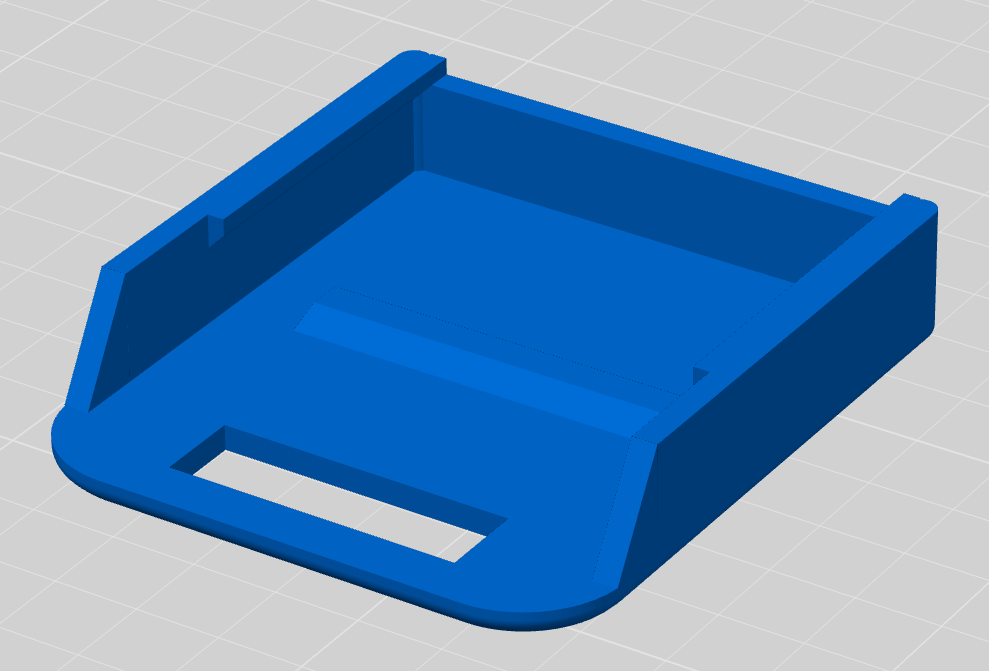
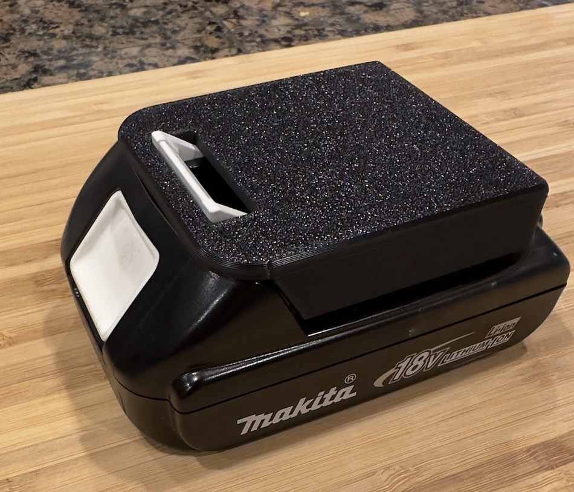

# Makita 18V Battery Cover

A simple [OpenSCAD](https://openscad.org) program to create a 3D model for Makita 18V battery covers. This is essentially a remix of [a design from Thingiverse](https://www.thingiverse.com/thing:5892130) with a few enhancements:

- Corners and edges have been rounded
- The shape of the cover more closely matches the shape of Makita's 18V batteries
- Tolerances have been tightened up so the cover doesn't rattle

Requires the [BOSL2 Library](https://github.com/BelfrySCAD/BOSL2) from BelfrySCAD. You could definitely implement this model without BOSL2, but using it saves time and makes the code easier to read.

The covers are relatively small so virtually any 3D printer should be capable of printing them. I've been printing these in PLA using a Bambu Lab P1S printer. I use the standard profile with 0.2mm layer height, 3 walls, and 20% infill.
